# Keycloakを使ったSSO検証

## 概要
SSOの流れをハンズオンを通して学習したいと思い実施しました。

## 前提条件
dockerのインストールが必要

## 環境
- OS：Windows 11
- ターミナル：WSL2（Ubuntu）
- コンテナ環境：Docker Desktop
- 使用コンテナ：Keycloak（quay.io/keycloak/keycloak）

## 構成
ブラウザ<br>
 ↓<br>
アプリA（ログイン）<br>
 ↓<br>
Keycloak（認証）<br>
 ↓<br>
アプリB（ログイン不要で入れる）<br>

## 実施内容

### 1.dockerでKeycloakを立てる

#### dockerがインストールされてるか確認
```wsl
$ docker --version
Docker version 29.5.3, build xxxxxxx
```
> 表示されなければdockerをインストールしてください

#### keycloakを立てる
```wsl
$ docker run -p 8080:8080 quay.io/keycloak/keycloak start-dev
```
- docker run   : コンテナ起動
- -p 8080:8080 : 自分のPCとコンテナのポートをつなぐ
- quay.io/keycloak/keycloak : Dockerイメージ（使うアプリ）
- start-dev    : 開発モードで起動

#### Keycloakにアクセスしてみる（ http://localhost:8080 ）

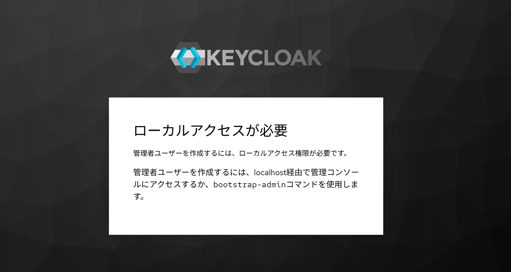
> 管理者ユーザーでログインする必要があるみたい

#### 管理者ユーザーを起動時に環境変数として渡す
```wsl
$ docker run -p 8080:8080 \
-e KEYCLOAK_ADMIN=admin \
-e KEYCLOAK_ADMIN_PASSWORD=admin \
quay.io/keycloak/keycloak start-dev
```
> これで起動時に自動的に管理者ユーザーが作成される

#### 再度アクセスしてみる（ http://localhost:8080 ）

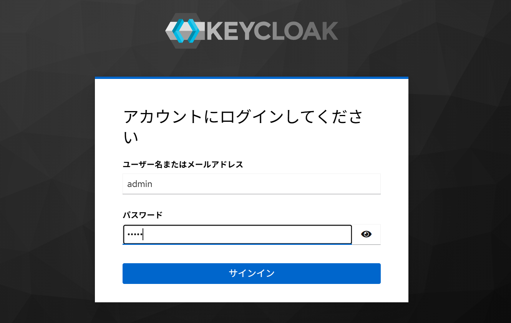
> 先ほど引数に渡した管理者ユーザー名とパスワードでログイン

#### ログインに成功するとこのような画面に進めるはず
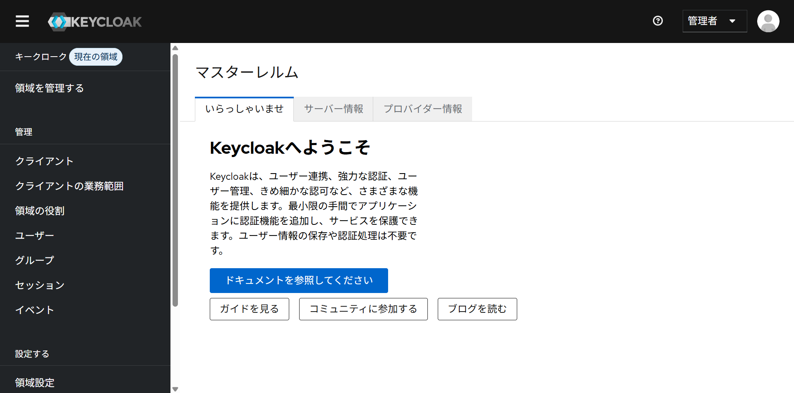
> ブラウザの警告が出ますが検証用なので無視して大丈夫です（ローカル環境で動作しているため基本大丈夫）

### 2.Realmの作成

Keycloakでは、Realmという単位でユーザーや認証設定を管理する。

今回は検証用として `test-realm` を作成する。

> 手順：領域を管理する（Manage realms）　→　領域の作成（Create Realm）

#### 領域の作成
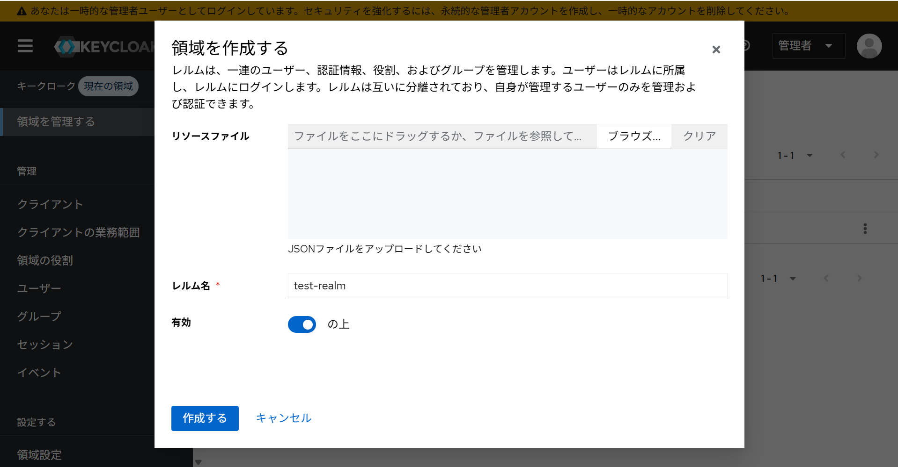

このようになれば成功
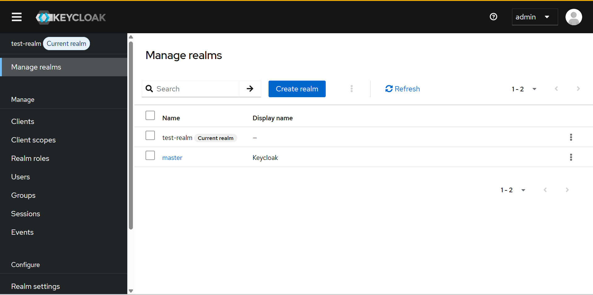
> `test-realm`がcurrent realmになる

### 3.Userの作成

今回はSSO検証のため、ログイン確認用のユーザーとして `testuser` を作成する。

> 手順：ユーザータブに移動　→ ユーザーの新規作成 → 資格情報（パスワード）を作成

#### ユーザータブに移動
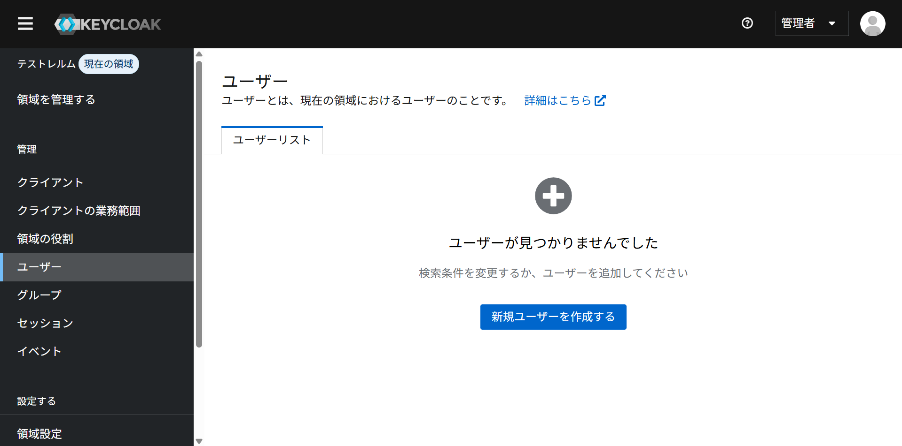

#### ユーザーの新規作成
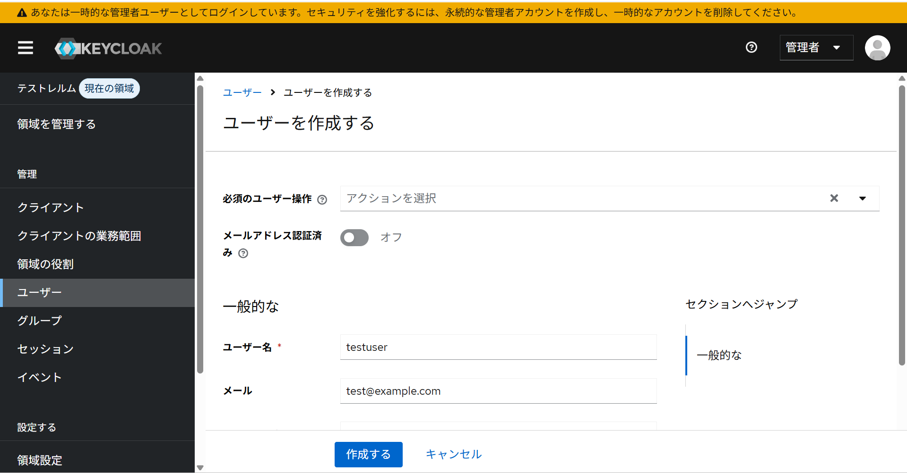
> ユーザー名:`testuser`<br>
> メールアドレス:`test@example.com`（任意）<br>
> その他はそのままでOK

#### 資格情報（パスワード）を作成
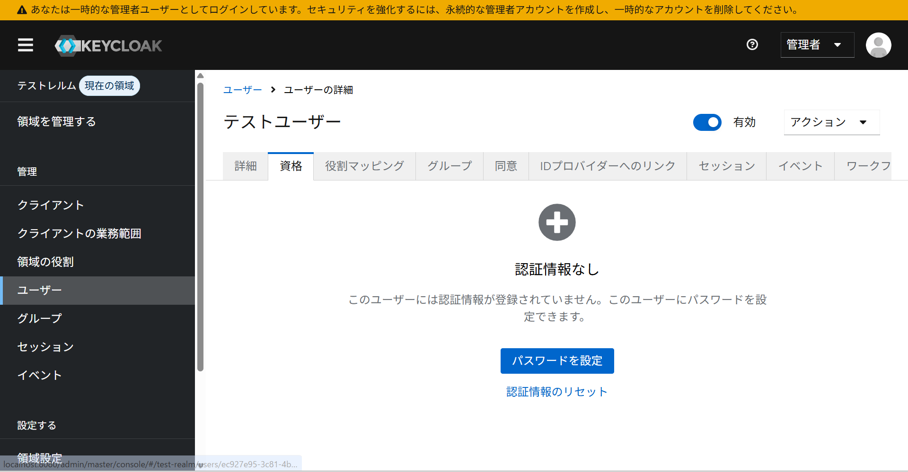
> ユーザー作成直後はパスワードが未設定のためログインできない。<br>
> そのため、資格情報（Credentials）タブからパスワードを設定する。

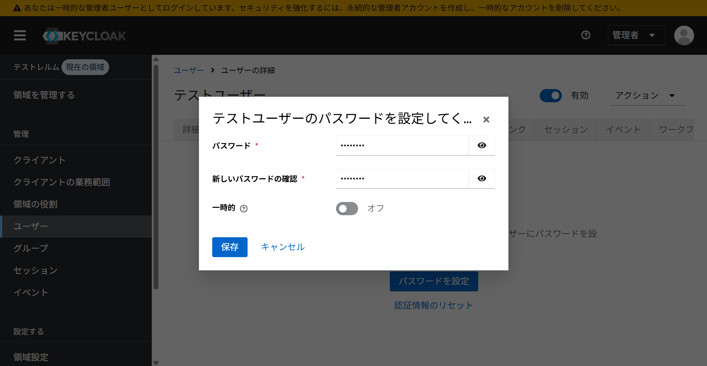
> TemporaryはOffにする

### 作成したユーザーでログインしてみる（ http://localhost:8080/realms/test-realm/account ）

#### ログイン画面
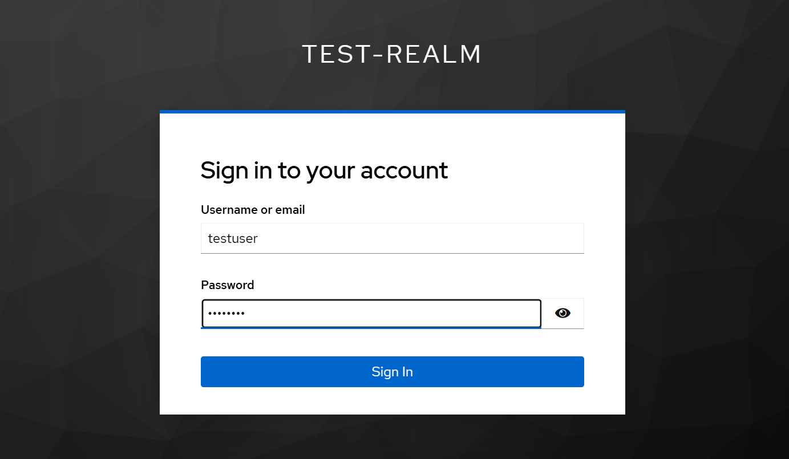
> 作成したユーザーとパスワードを入力してログイン

#### その他の情報を入力
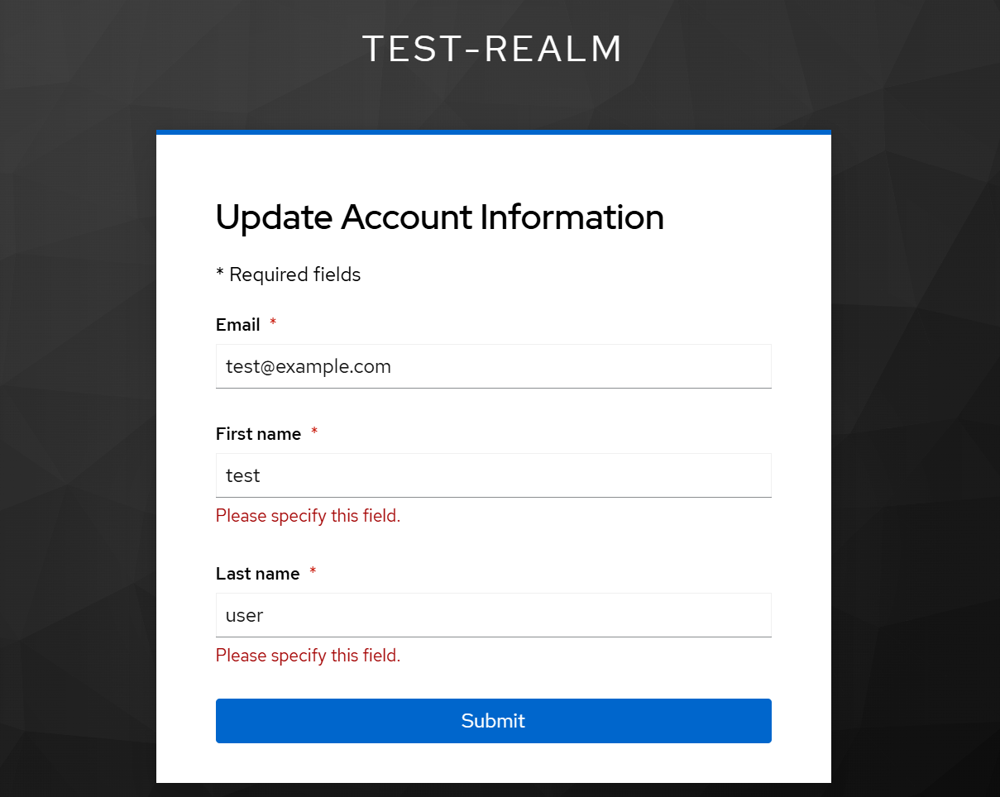
> ここは適当に値を設定（Email,姓,名）

#### ログイン成功
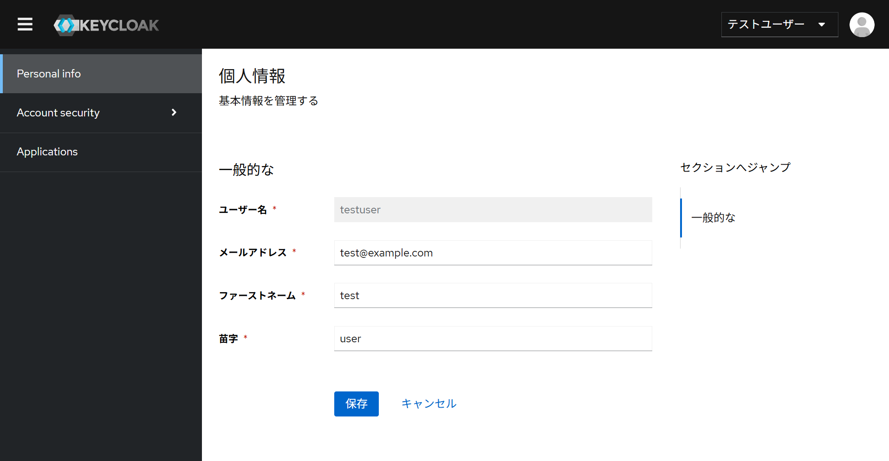
> 作成したユーザーでログインできることを確認した。<br>
> これにより、Keycloak上でユーザー認証が正常に機能していることが分かる。

### 4.アプリの作成
実際にSSOの動きを確認していきます。

今回はSSOの動きを確認することが目的なので、アプリのコード自体はAIに作成してもらいました。（Node.js）

#### 1.プロジェクトの作成
```wsl
# ディレクトリ作成
mkdir sso-app
cd sso-app

# 初期化
npm init -y

# パッケージインストール
npm install express express-session keycloak-connect
```

#### 2.サーバーコード（Node.js）
`app1.js`
```wsl
const express = require('express');
const session = require('express-session');
const Keycloak = require('keycloak-connect');

const app = express();

const memoryStore = new session.MemoryStore();

app.use(session({
  secret: 'secret',
  resave: false,
  saveUninitialized: true,
  store: memoryStore
}));

const keycloak = new Keycloak({ store: memoryStore });

app.use(keycloak.middleware());

app.get('/', (req, res) => {
  res.send('トップページ（未ログインでもOK）');
});

app.get('/protected', keycloak.protect(), (req, res) => {
  res.send('ログイン成功！保護されたページ');
});

app.listen(3000, () => {
  console.log('http://localhost:3000');
});
```
> エディタはVSCodeを使用（各自作業しやすいエディタを使ってください）

#### 3.クライアントの作成（Keycloak側設定）

- 管理者ユーザーでKeycloakにログインする

#### クライアントタブへ移動し、新規作成を選択
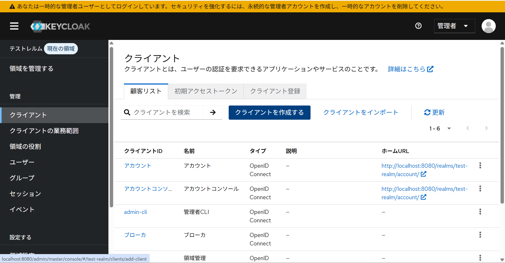

#### クライアント作成操作Ⅰ
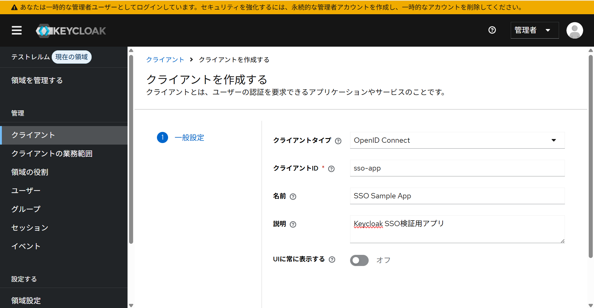
> クライアントタイプ：`OpenID Connect`<br>
> クライアントID:`sso-app`<br>
> 名前と説明は任意

#### クライアント作成操作Ⅱ
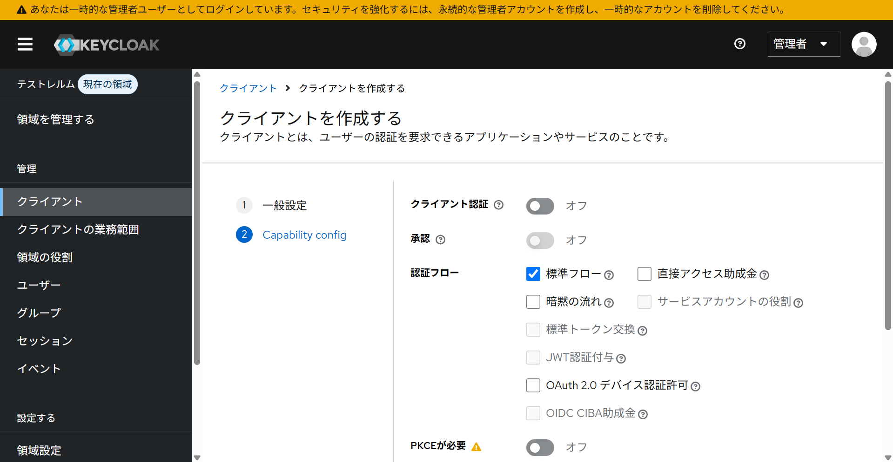
> ここはデフォルトのままでOK

#### クライアント作成操作Ⅲ
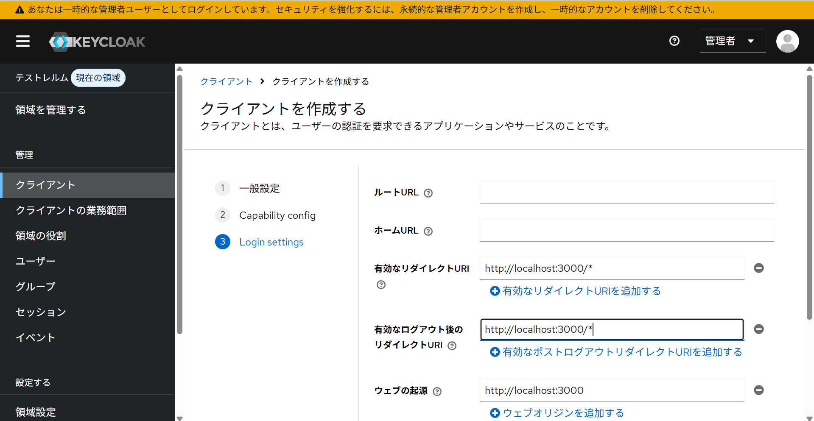
> 有効なダイレクトURI:`http://localhost:3000/*`（重要）<br>
> ウェブオリジン（CORS）:`http://localhost:3000`


#### 4.keycloak.jsonの作成
`keycloak.json`
```wsl
{
  "realm": "test-realm",  # 作成したRealm
  "auth-server-url": "http://localhost:8080", # Keycloakのポート
  "ssl-required": "external",
  "resource": "sso-app",
  "public-client": true,
  "confidential-port": 0
}
```
> ※app.jsと同じ階層に作成すること

#### ターミナルからアプリ起動
```wsl
$ node app1.js
```

#### サイトにアクセスしてログイン（ http://localhost:3000/protected ）
うまくいけばログイン画面に飛ぶはず
> もしうまくいかなかったら、クライアントの設定内容とkeycloak.jsonの設定内容等を確認してください（ファイルやフォルダ等の名前も合わせておくと確実）

### 5.SSOログインを体験（本題）
今のままではSSOログインを体験できないので、同じアプリをコピーして一度ログインしたらもう片方のアプリがログイン不要で起動できることを体験します。

#### 既存アプリのコピー
```wsl
$ cp -r sso-app sso-app2　←　プロジェクトフォルダ（親）の階層に作成してね
$ cd sso-app2 
```

#### app.jsのポート変更
```wsl
# app.jsのapp.listen(3000)をapp.listen(3001)に変更する

# 変更前
app.listen(3000, () => {
  console.log('http://localhost:3000');
});

# 変更後
app.listen(3001, () => {
  console.log('http://localhost:3001');
});
```

#### Keycloak側の設定追加（クライアント）

先ほど作成したClientの編集を行います


## 課題・詰まった点


## 学んだこと


## 参考資料
- [Keycloak の使い方](https://qiita.com/ekzemplaro/items/84bae6460993b3529580)
